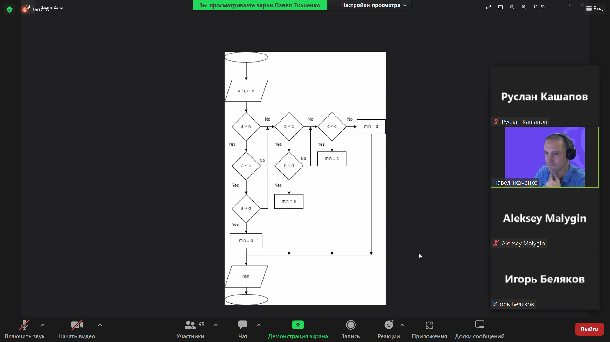

Домашняя работа.

# Заголовок текста размер 1
## Заголовок текста размер 2
**Полужирный текст**

Обычный текст

* Ненумерованный список 1
* Ненумерованный список

1. Нумерованный список 1
2. Нумерованный список 2

-------
Горизонтальная линия

>Перенос  
строчки в цитате

Ссылки на сайты [Google][1] and [Yandex][2].

[1]: http://google.com "Goole"
[2]: http://yandex.ru "Yandex"

